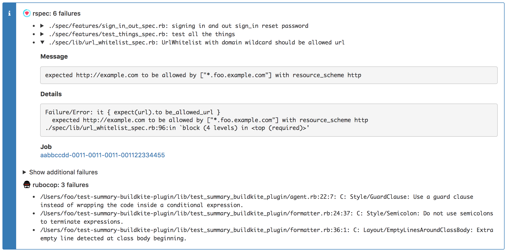

# Test Summary Buildkite Plugin

A [Buildkite plugin](https://buildkite.com/docs/agent/v3/plugins) that adds a single annotation
of all your test failures using
[buildkite-agent annotate](https://buildkite.com/docs/agent/v3/cli-annotate).

Supported formats:

* JUnit
* [Tap](https://testanything.org)
* Plain text files with one failure per line

## Example

Upload build results as artifacts using any supported format

```yaml
steps:
  - label: rspec
    command: rspec --format RspecJunitFormatter --out artifacts/rspec-%n.xml
    parallelism: 10
    artifact_paths: "artifacts/*"

  - label: ava
    command: yarn --silent test --tap -o artifacts/ava.tap
    artifact_paths: "artifacts/*"

  - label: rubocop
    command: rubocop -f emacs -o artifacts/rubocop.txt
    artifact_paths: "artifacts/*"
```

Wait for all the tests to finish

```yaml
  - wait: ~
    continue_on_failure: true
```

Add a build step using the test-summary plugin

```yaml
  - label: annotate
    plugins:
      bugcrowd/test-summary#v1.0.0:
        inputs:
          - label: rspec
            artifact_path: artifacts/rspec*
            type: junit
          - label: ava
            artifact_path: artifacts/ava.tap
            type: tap
          - label: rubocop
            artifact_path: artifacts/rubocop.txt
            type: oneline
        formatter:
          type: details
        context: test-summary
```

## Configuration

### Inputs

The plugin takes a list of input sources. Each input source has:

* `label:` the name used in the heading to identify the test group
* `artifact_path:` a glob used to download one or more artifacts
* `type:` one of `junit`, `tap` or `oneline`
* `encoding:` The file encoding to use. Defaults to `UTF-8`

### Formatter

There are two formatter types, `summary` and `details`. The `summary` formatter
only includes a single line in the markdown for each failure.


The details formatter
includes extra information about the failure in an accordion (if available).



Other formatter options are:

* `show_first:` The number of failures to show before hiding the rest inside an accordion.
  If set to zero, all failures will be hidden by default. If set to a negative number, all failures
  will be shown. Defaults to 20.

### Other options

* `context:` The buildkite annotation context. Defaults to `test-summary`
